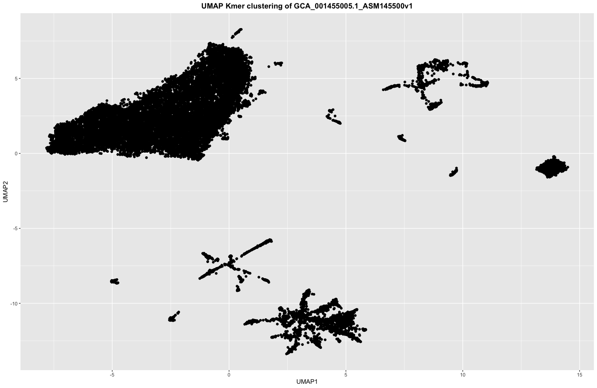
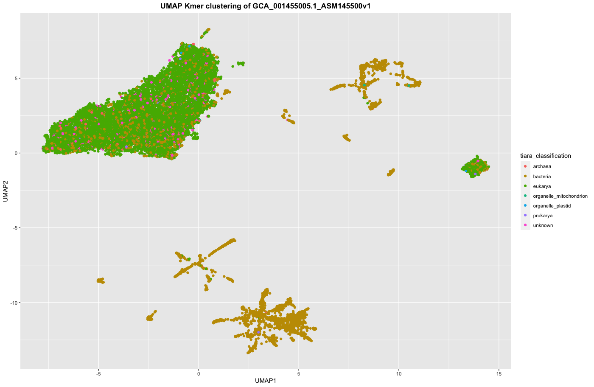

# Assembly Kmer Clustering

[Jamie McGowan, 2023](https://jamiemcgowan.ie)

Tool to cluster and visualise contigs from a genome assembly using kmer frequencies

### Dependencies

- python
	- biopython
	- tqdm
- r
	- ggplot2
	- umap

	

### Installation

You can install the dependencies using the provided yaml file `conda_env.yaml`

```
git clone https://github.com/jamiemcg/assembly_kmer_composition
cd assembly_kmer_composition

conda env create -f conda_env.yaml
conda activate assembly_kmer_composition
```

### Usage

**Kmer counting**

The python script `kmer_composition.py` counts kmers from sequences in FASTA format of a specified kmer length

```
python kmer_composition.py [assembly.fasta] [kmer_length] [output_file]
```

For example, to count the frequencies of kmers of length 4 and save them to a file called `tet.tsv`:

```
python kmer_composition.py assembly.fasta 4 tet.tsv
```

**Plotting**

The R script `plot_umap_kmer_freq.r` clusters the contigs based on UMAP dimensionality reduction of kmer frequencies and plots clustered contigs.

```
Rscript plot_umap_kmer_freq.r [kmer_count_file.tsv] [output_dir] [output_prefix]
```

For example:

```
Rscript plot_umap_kmer_freq.r tet.tsv . my_assembly
```

Will create a file `my_assembly_UMAP.tsv` with the UMAP coordinates and a plot `my_assembly_UMAP.pdf` visualising the clusters.


### Example plots
For example, here is plot showing a contaminated tardigrade assembly (GCA_001455005.1 ASM145500v1) clustered based on 4-mers:



You could overlay such plots with the output from a taxonomic classifier, e.g. here is the same plot with contigs coloured by [Tiara](https://github.com/ibe-uw/tiara/) classifications





### Interactive Version

.....
